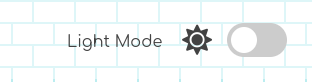
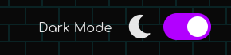

# advancedJS_Light Dark Mode: [LIVE DEMO](https://shcoobz.github.io/advancedJS_light-dark-mode/)

 

## Summary

advancedJS_light-dark-mode provides a dynamic theme switching capability for web applications. It features an intuitive toggle switch that allows users to switch between light and dark modes seamlessly.

The core functionality includes:

- Light and Dark mode toggle
- Persistent theme settings across sessions using local storage
- Immediate visual feedback on theme change

## Features

### Theme Switching

Allows users to toggle between a light and a dark theme. The state of the theme is preserved with local storage so that the preference is maintained across browser sessions.

### Responsive Navigation Bar

A responsive navigation bar that adapts to different screen sizes, providing smooth navigation throughout the application.

### Dynamic Content Sections

Content sections like Home, About, Projects, and Contact are dynamically rendered, demonstrating the application's modular architecture.

### Additional Features

- FontAwesome icons integration for aesthetic enhancement.
- Use of React functional components for clean and efficient code.
- Deployment ready setup with Vite, optimized for performance.

## Technologies

- React: Used for building the user interface with component-based architecture.
- Vite: As a build tool for blazing fast development and optimized production builds.
- FontAwesome: Provides icons used across the application for a visually engaging user experience.
- CSS: For styling and animations, demonstrating both light and dark mode aesthetics.

---

_Note: This document provides an overview of advancedJS_light-dark-mode. For detailed instructions and more information, please refer to the source code documentation._

_This project is a conversion from an earlier version built with vanilla JavaScript and HTML, available [here](https://github.com/Shcoobz/basicJS_light-dark-mode/). This conversion integrates React to enhance UI reactivity and maintainability._
